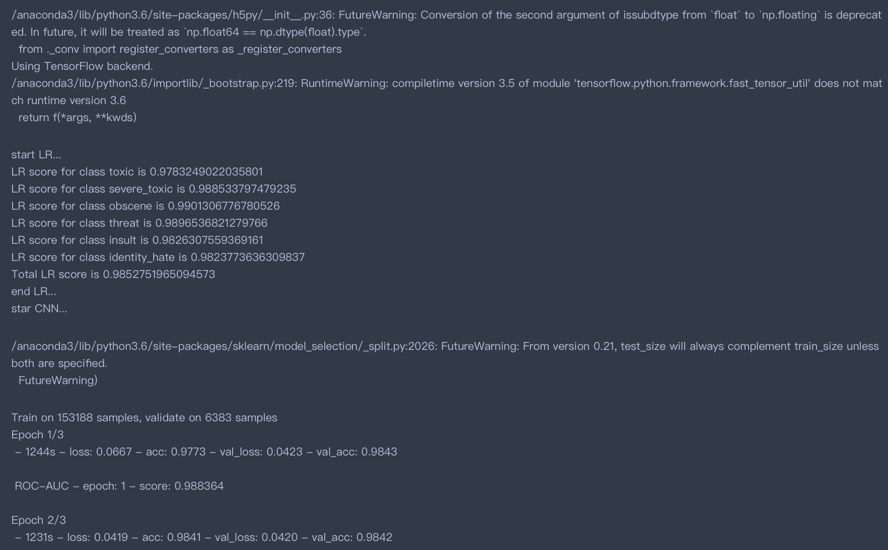
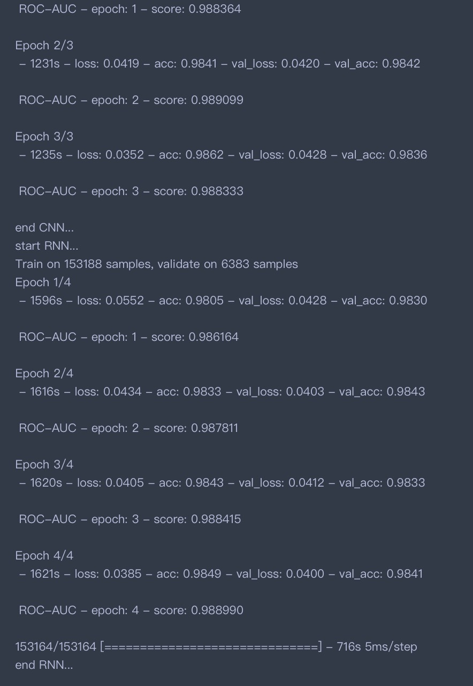

### 1､项目中用到的库
pandas、sklearn、scipy、keras

预训练词向量：

crawl-300d-2M.vec

glove.840B.300d.txt

### 2､代码运行结果
submission_LR.csv是LR模型的预测结果；

submission_CNN.csv是textCNN模型的预测结果；

submission_RNN.csv是RNN模型的预测结果；

325submission.csv是以上三个模型预测结果的加权平均，是最终提交到kaggle上的结果。

运行时间：3时47分30秒

运行截图：

